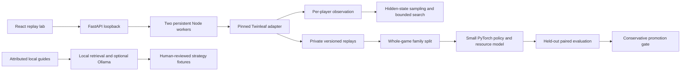

# Architecture and research boundaries

## Simulator

The catalog explicitly registers 37 card implementations across five complete decks. No server, account service, database, or network code is started by the bundled worker. Catalog generation preserves exact legal reprint identity while reusing upstream effect classes. The frozen format is a closed card pool, not a full current Standard database.

Seeded chance events and decision IDs support deterministic continuation. Unfinished generator/callback effects are reconstructed by replaying seeded actions, rather than serializing live callbacks. The adapter enumerates legal actions, validates supported prompt choices, and probes turn actions on isolated state copies. High-cardinality prompt choices have bounded enumeration and explicit warnings; exhaustive action completeness is not claimed for the whole rules engine.

Builds fingerprint the local source and deck definitions. Record this fingerprint, deck hash, seeds, and model/data hashes with each experiment. Historical development builds preceding source fingerprints remain historical smoke data, not a rules certification corpus.

## Information boundaries and search

Agents receive only one player's observation. Opponent hand identities, private prizes, and hidden deck order never enter that policy input. Replays deliberately retain separate private observations for research; only the selected view enters analysis. Private opponent prompt labels are redacted in the UI. Saved positions contain a single observation.

Stable turn observations may include a whitelisted `searchPosition`: public Pokémon evolution stacks, damage, public flags/markers, visible zones, zone counts, and our known hand. Belief reconstruction creates a fresh state and samples hidden hands, prizes, and decks from compatible deck hypotheses. It does not clone the real hidden game. Live callbacks and effects that cannot be reconstructed safely cause an explicit unsupported result.

Flat rollouts allocate samples across legal candidates. The experimental ISMCTS implementation uses observation-keyed nodes and UCB action selection with independently sampled hidden states. Both use fixed compute limits and the same untrained leaf evaluator. Search estimates mix genuine terminal results with labeled heuristic cutoffs; uncertainty is sample standard error, not a calibrated confidence interval or proof of optimality. Strategy fusion, incomplete historical knowledge, prompt coverage, and compute budgets remain material limitations. A wall-clock budget bounds work between steps; one indivisible engine step can overrun it.

## Learning and evaluation

The small network uses visible-card embeddings, semantic action features, nonlinear additive resource terms, a learned baseline, and a context interaction term. Its summed outcome logit is divided by ln(2) for engine advantage units. The UI exposes terms separately. Feature schemas are versioned; old checkpoints cannot silently load into incompatible feature definitions.

Final results provide the main supervised target: win 1, true draw 0.5, loss 0. Truncated and errored games are excluded. The first policy head imitates the generating policy; search-policy distillation and an automated historical population curriculum are subsequent work. Avoid confusing imitation loss improvement with stronger play.

Train/calibration/test splits keep complete seed-and-deck families together. Calibration is separate from fitting the model. This implementation withholds W/D/L predictions when calibration requirements are unmet. The first tiny datasets cannot establish calibration, tactical quality, or improvement. Data generated by held-out evaluation is marked and excluded from training by default.

The evaluation matrix separately records each candidate deck against every opponent deck with swapped seats. This does not by itself guarantee balanced actual going-first positions after coin-choice decisions. Report the measured first-player distribution. Never silently label such a run first-player balanced. A champion promotion gate can be conservative without proving lack of regressions: expert review and larger matchup samples remain necessary.

## Local operational limits

The API pool permits at most two simulation workers and eight queued jobs. Each Node process has a 1 GiB V8 heap cap; that is not a total-process or system memory guarantee. The local store checks a 2 GiB data budget before JSON writes. Parquet/model/tracker files also require monitored disk use; these limits are safeguards, not a filesystem quota. Model runs are explicit commands. There is no unattended forever-training loop, cloud billing, background model download, or network fallback.

Self-play manifests checkpoint between games and training checkpoints between epochs. Abrupt termination may lose the in-flight game/epoch; rerunning deterministic seeds recovers work. API jobs interrupted by restart are labeled interrupted. Long games remain legitimate; a decision cap records truncation without assigning a winner.

## Research references

- [Twinleaf source](https://github.com/the-epsd/twinleafgg/tree/b26ec9c1c5ea62849f2c248b17fec171aff108ca)
- [Competition organizer restrictions](https://www.kaggle.com/competitions/pokemon-tcg-ai-battle/discussion/717141)
- [Information Set Monte Carlo Tree Search](https://eprints.whiterose.ac.uk/id/eprint/75048/)
- [Official Crustle](https://www.pokemon.com/us/pokemon-tcg/pokemon-cards/series/sv10/186/)
- Format sources are recorded alongside dates in `formats/standard-2026-09-17.json`.
