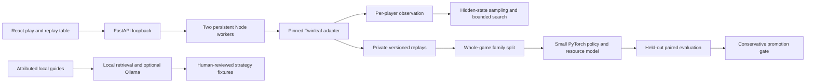

# Architecture and research boundaries

## Simulator

The catalog explicitly registers 98 printings for fifteen competitive manifests and five historical engineering fixtures. Each archetype has one main, one training variant, and one reserved test variant. No server, account service, database, or network code is started by the bundled worker. Catalog generation preserves exact printing identity while reusing upstream effect classes. The frozen format is a closed card pool, not a full current Standard database. Construction validation and provider metadata checks do not certify every rule or legal reprint; competitive manifests remain training-ineligible while those audits are pending.

Seeded chance events and decision IDs support deterministic continuation. Unfinished generator/callback effects are reconstructed by replaying seeded actions, rather than serializing live callbacks. The adapter enumerates legal actions, validates supported prompt choices, and probes turn actions on isolated state copies. Staged selections replace the former 256-combination cap for supported selection prompts. Unsupported prompt types still require explicit coverage and must not silently become trusted training data.

Builds fingerprint the local source and deck definitions. Record this fingerprint, deck hash, seeds, and model/data hashes with each experiment. Historical development builds preceding source fingerprints remain historical smoke data, not a rules certification corpus.

## Information boundaries and search

Agents receive only one player's observation. Opponent hand identities, private prizes, and hidden deck order never enter that policy input. Replays deliberately retain separate private observations for research; only the selected view enters analysis. Private opponent prompt labels are redacted in the UI. Saved positions contain a single observation.

Stable turn observations may include a whitelisted `searchPosition`: public Pokémon evolution stacks, damage, public flags/markers, visible zones, zone counts, and our known hand. Belief reconstruction creates a fresh state and samples hidden hands, prizes, and decks from compatible deck hypotheses. It does not clone the real hidden game. Live callbacks and effects that cannot be reconstructed safely cause an explicit unsupported result.

Flat rollouts allocate samples across legal candidates. The experimental ISMCTS implementation uses observation-keyed nodes with independently sampled hidden states and can receive learned root-action priors. Both methods retain heuristic leaf evaluation. Search estimates mix genuine terminal results with labeled heuristic cutoffs; uncertainty is sample standard error, not a calibrated confidence interval or proof of optimality. Strategy fusion, unsupported knowledge/effect reconstruction, prompt coverage, and compute budgets remain material limitations. A wall-clock budget bounds work between steps; one indivisible engine step can overrun it.

Listed hypotheses exclude reserved and historical exact lists. A bounded unknown-variant component uses supported training-pool cards and revealed evidence. Explicit known-list laboratory mode is separate. Search preserves supported own-deck searches and known top order, and refuses knowledge it cannot safely reconstruct. The displayed Python composition prior is labeled separately from the simulator search posterior.

## Durable play

Private best-of-three journals hold seeds, exact lists, frozen policy hashes, engine fingerprints, accepted actions, idempotency receipts, and shared turn-budget consumption. Live responses expose only the human observation and redacted session metadata. Restart reconstructs accepted actions and pauses incompatible or failed sessions. Benchmark mode blocks analysis and private research routes until the match ends. Concessions are recorded human outcomes; interrupted simulations never become fabricated losses or draws.

Public cards revealed in previous games can constrain later list beliefs. Full private research replays are published only through the explicit completed-match operation. Card art is an optional browser request to verified TCGdex URLs; text remains available offline. No card image files are bundled.

## Learning and evaluation

The small network uses visible-card embeddings, semantic action features, nonlinear additive resource terms, a learned baseline, and a context interaction term. Its summed outcome logit is divided by ln(2) for engine advantage units. The UI exposes terms separately. Feature schemas are versioned; old checkpoints cannot silently load into incompatible feature definitions.

Final results provide the main supervised target: win 1, true draw 0.5, loss 0. Truncated and errored games are excluded. Behavior cloning remains a baseline. Sufficiently sampled search decisions provide soft policy targets tied to a pre-decision observation hash. Population cycles mix baselines, champion and historical checkpoints; reviewed concrete teaching positions are admitted only from training families and verified rules. Avoid confusing imitation loss improvement with stronger play.

Train/calibration/test splits keep complete seed-and-deck families together. Calibration is separate from fitting the model. This implementation withholds W/D/L predictions when calibration requirements are unmet. The first tiny datasets cannot establish calibration, tactical quality, or improvement. Data generated by held-out evaluation is marked and excluded from training by default.

The evaluation matrix separately records each candidate deck against every opponent deck with controlled first-player assignment. Reports retain actual first-player counts and exact manifest hashes, including reserved variants when requested. A champion promotion gate can be conservative without proving lack of regressions: expert review and larger matchup samples remain necessary.

## Local operational limits

Profiles start with two simulation workers. Mac targets 8 GiB of process-tree memory and 25 GiB of managed data; Windows targets 40/200 GiB. Every destination preserves 20 GiB free. These are monitored targets, not operating-system quotas. The memory monitor covers the launching Python process and descendants; separately launched API/LLM processes and model caches outside the managed data root are not globally accounted for. Run heavyweight workloads separately until broader accounting is implemented.

Self-play manifests checkpoint between games. Training saves optimizer state periodically and at epoch boundaries. Manually launched continuous cycles consist of bounded batches; there is no startup scheduler. The replay buffer limits loaded training history while retaining permanent source artifacts. Compressed Parquet exports stream records. Immutable bundles validate paths, checksums, partitions and compatibility before publication/import, and cross-device continuation receives linked provenance. Live SQLite databases and raw guides are excluded. Long games remain legitimate; a decision cap records truncation without assigning a winner. See `PORTABLE_RESEARCH.md` for commands and operational limits.

## Research references

- [Twinleaf source](https://github.com/the-epsd/twinleafgg/tree/b26ec9c1c5ea62849f2c248b17fec171aff108ca)
- [Competition organizer restrictions](https://www.kaggle.com/competitions/pokemon-tcg-ai-battle/discussion/717141)
- [Information Set Monte Carlo Tree Search](https://eprints.whiterose.ac.uk/id/eprint/75048/)
- [Official Crustle](https://www.pokemon.com/us/pokemon-tcg/pokemon-cards/series/sv10/186/)
- Format sources are recorded alongside dates in `formats/standard-2026-09-17.json`.
